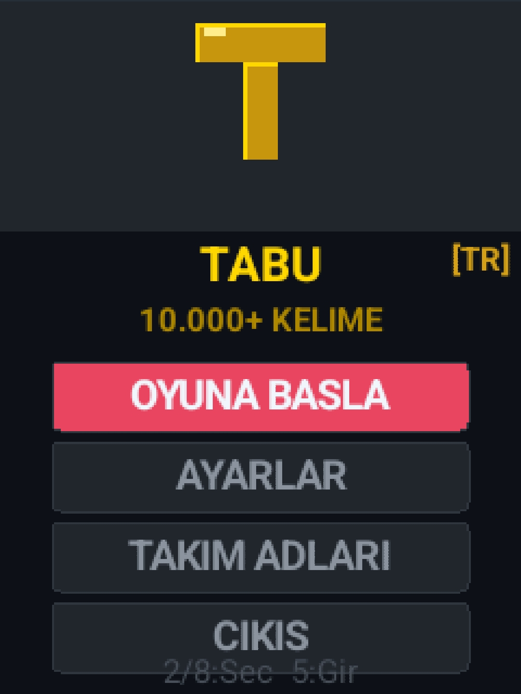
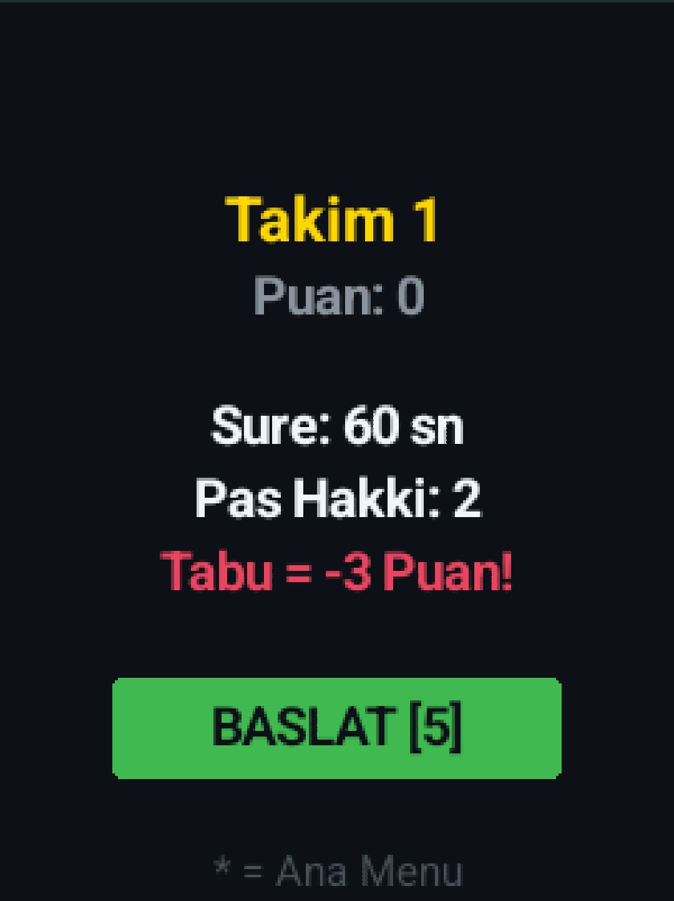
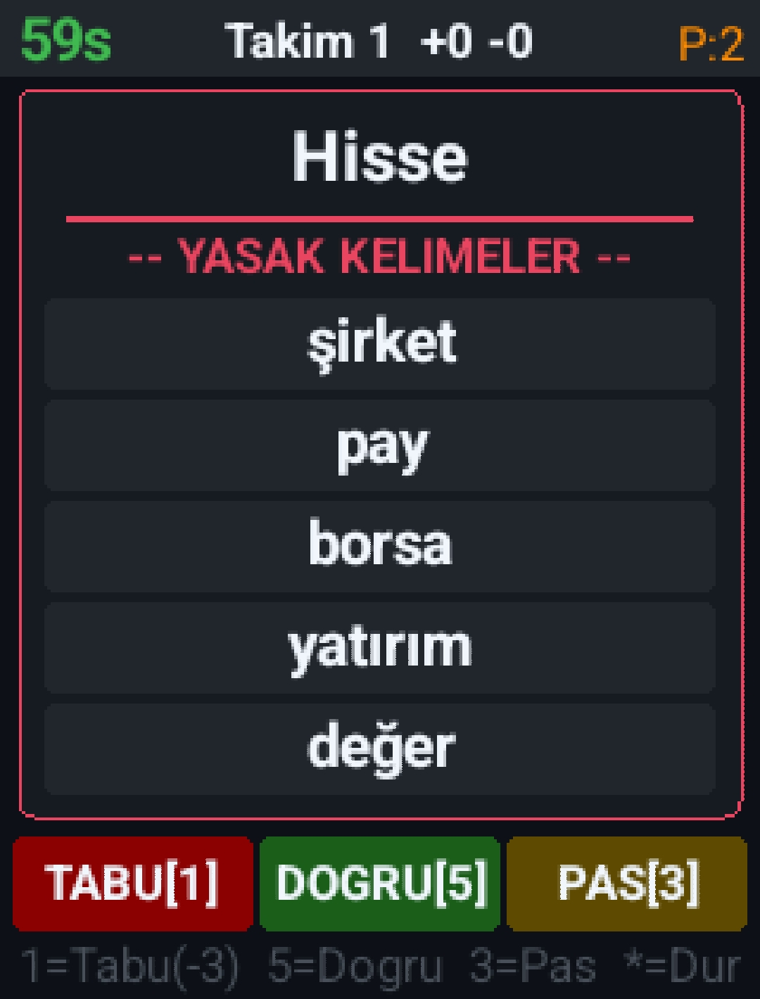
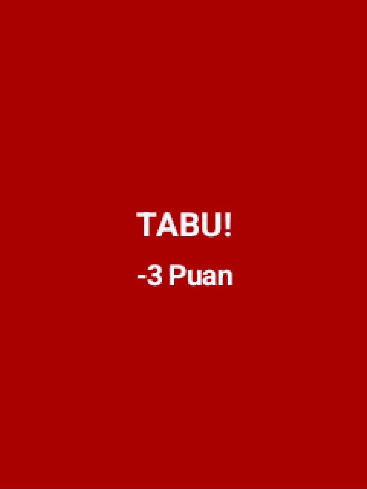
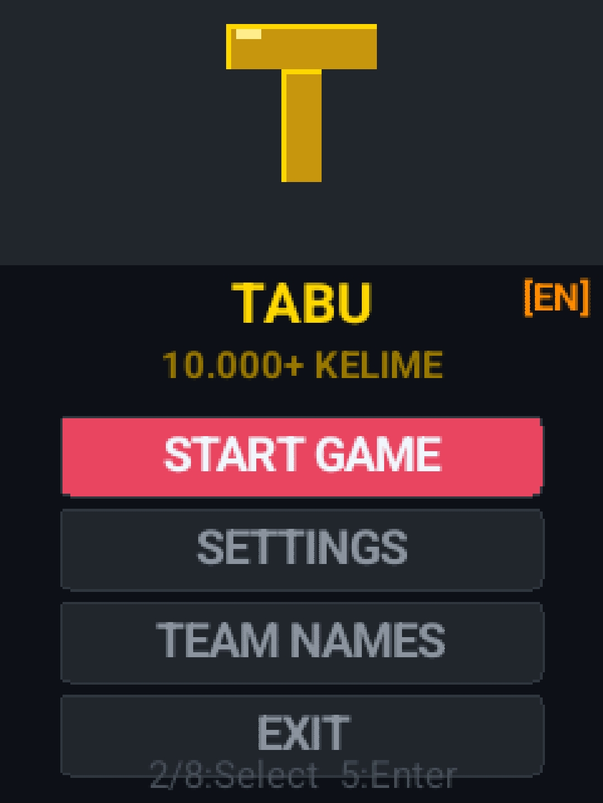
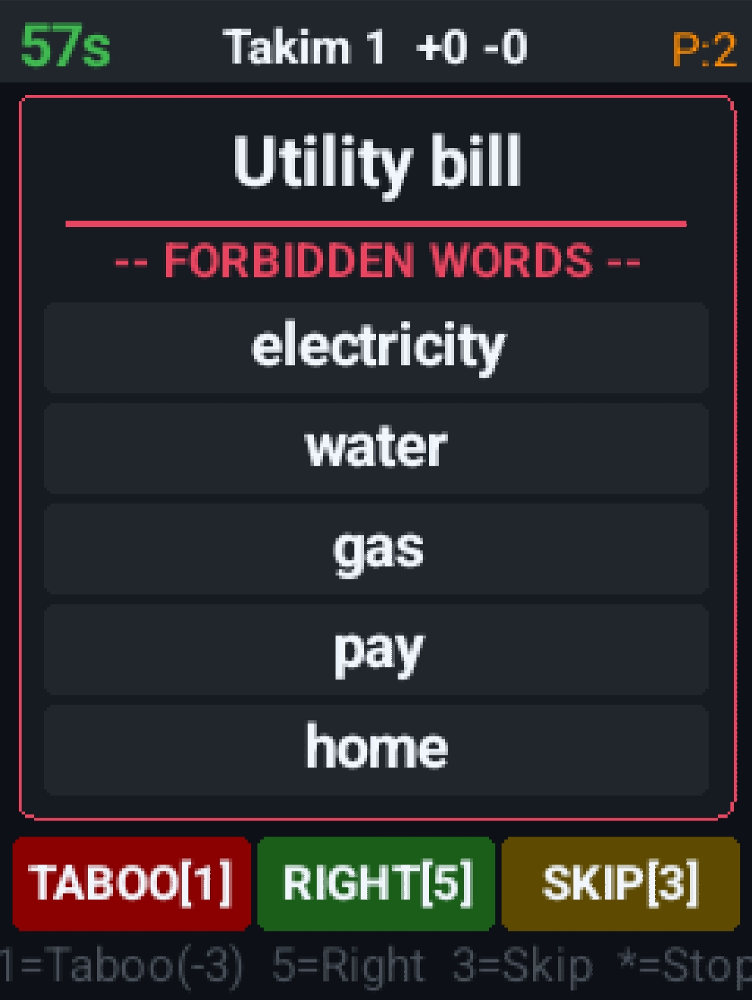

# TABU - J2ME Mobile Game

<p align="center">
  
</p>

<p align="center">
  <b>A Turkish/English Taboo word game for J2ME phones and Android (via J2ME Loader)</b><br>
  MIDP-2.0 / CLDC-1.1 • 1752 Cards • 2-6 Teams • 8 Themes
</p>

---

## 📱 Features

- **Bunch of both Turkish 🇹🇷 and English 🇺🇸 cards**
- **Turkish / English** language support with flag icons
- **2-6 teams** with custom team names
- **8 color themes** — Dark, Pink Dark, Pink Light, Blue, Orange, Forest, Purple, Yellow
- **Background music** — MIDI loop music
- **Adjustable** round time (30–120 sec), pass limit, number of rounds
- **Taboo = -3 points** penalty
- **Winner screen** with confetti animation
- **Statistics** — total correct, taboo, pass, high score, last 5 games
- **Persistent save** — settings and stats saved between sessions (RecordStore)
- **Card animations** — smooth ease-out transition between cards
- Compatible with Nokia 6303i and other old J2ME phones

---

## 🕹️ Controls

| Key | In Game | In Menu |
|-----|---------|---------|
| **5** / Fire | ✅ Correct (+1) | Select |
| **1** / Left | ❌ Taboo (-3) | — |
| **3** / Right | ⏭ Pass | — |
| **2** / Up | — | Up |
| **8** / Down | — | Down |
| **\*** | Stop / Back | Back |
| **#** | — | Reset stats |

---

## 🔨 Build (Termux / Linux)

### Requirements
- Java JDK (openjdk-21)
- ProGuard 7.3.2 (for old phone compatibility)
- microemulator JAR (midp.jar)

### Steps

```bash
# Install Java
pkg install openjdk-21

# Download dependencies
wget https://repo1.maven.org/maven2/org/microemu/microemulator/2.0.4/microemulator-2.0.4.jar -O midp.jar
wget https://github.com/Guardsquare/proguard/releases/download/v7.3.2/proguard-7.3.2.zip
unzip proguard-7.3.2.zip

# Compile
mkdir -p build/classes
javac -source 8 -target 8 -classpath midp.jar -d build/classes \
  src/tabu/TabuData.java src/tabu/EngData.java \
  src/tabu/GameCanvas.java src/tabu/TabuMIDlet.java

# Create JAR
jar cfm TurkceTabu.jar META-INF/MANIFEST.MF -C build/classes . \
  logo.png tr.png en.png music.mid

# For old phones (Nokia etc.) - preverify + downgrade class version
java -jar proguard-7.3.2/lib/proguard.jar @proguard.pro
jar xf TurkceTabu_verified.jar
for f in tabu/*.class; do
  printf '\xca\xfe\xba\xbe\x00\x00\x00\x2e' | dd of=$f bs=1 count=8 conv=notrunc 2>/dev/null
done
jar cfm TurkceTabu_final.jar META-INF/MANIFEST.MF tabu/*.class logo.png tr.png en.png music.mid
```

---

## 📲 Installation

### J2ME Loader (Android)
1. Copy `TurkceTabu.jar` to Android
2. Open J2ME Loader → tap `+`
3. Select the JAR file
4. Config: **MIDP-2.0 / CLDC-1.1**
5. Play!

### Nokia / Old Phone
1. Copy `TurkceTabu_final.jar` to phone
2. Open with file manager and install

---

## 📸 Screenshots

<p align="center">
  
  
  
</p>
<p align="center">
  
  
  
</p>

---

## 📁 Project Structure

```
TurkceTabu/
├── src/tabu/
│   ├── TabuMIDlet.java   # Main MIDlet
│   ├── GameCanvas.java   # Game logic & UI
│   ├── TabuData.java     # 1752 Turkish cards
│   └── EngData.java      # 318 English cards
├── META-INF/MANIFEST.MF
├── logo.png              # App icon
├── tr.png                # Turkish flag
├── en.png                # English flag
├── music.mid             # Background music
├── proguard.pro          # ProGuard config
└── screenshots/
```

---

## 👤 Developer

**UmutK** — v3.0

---

## 📄 License

MIT License
